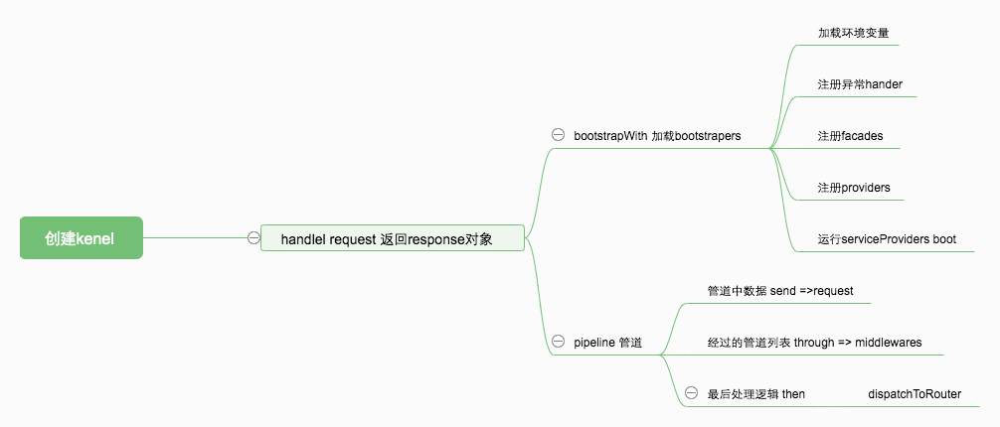

### 1.初始化

- 设置basepath `setBasePath`
- 注册基础绑定 `Application::registerBaseBindings` 
  - `instance` 
  -  `instances.app`
  -  `instances.container` 
- 注册服务容器 `Application::registerBaseServiceProviders()`
  - `EventServiceProvider`
  - `LogServiceProvider`
  - `RoutingServiceProvider`
- 注册别名`Application::registerCoreContainerAliases()`
  - `app=>`

### 2. 处理 `$kernel->handle`

- `boostrap` 注册 `Application::bootstrapWith` 

  - 加载配置`LoadEnvironmentVariables`

  - 注册异常handler `HandleExceptions`

  - 注册Facade  `RegisterFacades`

  - 注册provider `RegisterProviders` 配置文件中`app.provider`

  - 启动 `BootProvider`  

    ```php
    array_walk($this->serviceProviders, function ($p) {
                $this->bootProvider($p);
            });
    ```

    - `app()->boot()`
    - `app()->bootProvider()`

  - 加载路由`RouterProvider`

    - `Illuminate\Foundation\Support\Providers\RouteServiceProvider::boot()`

    - `Illuminate\Foundation\Support\Provider\RouteServiceProvider::loadRoutes()` 加载路由调`App\Providers\RouteServiceProvider::map()`方法

      ```php
      if (in_array($method, $this->allowedAttributes)) {
                  if ($method === 'middleware') {
                      return $this->attribute($method, is_array($parameters[0]) ? $parameters[0] : $parameters);
                  }
      
                  return $this->attribute($method, $parameters[0]);
              }
      ```

- 执行pipeline流水线

  ```php
  return (new Pipeline($this->app))
                      ->send($request)
                      ->through($this->app->shouldSkipMiddleware() ? [] : $this->middleware)
                      ->then($this->dispatchToRouter());
  ```

  - then的代码实现逻辑 利用array_reduce 返回一个闭包。

  ```php
  public function then(Closure $destination)
      {
          $pipeline = array_reduce(
              array_reverse($this->pipes), $this->carry(), $this->prepareDestination($destination)
          );
  
          return $pipeline($this->passable);
      }
  ```

  - carry 依次执行每个pipe。也就是middleware的handle 并返回response

  ```php
  protected function carry()
      {
          return function ($stack, $pipe) {
              return function ($passable) use ($stack, $pipe) {
                  try {
                      if (is_callable($pipe)) {
                          
                          return $pipe($passable, $stack);
                      } elseif (! is_object($pipe)) {
                          [$name, $parameters] = $this->parsePipeString($pipe);
                          $pipe = $this->getContainer()->make($name);
  
                          $parameters = array_merge([$passable, $stack], $parameters);
                      } else {
                          
                          $parameters = [$passable, $stack];
                      }
  
                      $carry = method_exists($pipe, $this->method)
                                      ? $pipe->{$this->method}(...$parameters)
                                      : $pipe(...$parameters);
  
                      return $this->handleCarry($carry);
                  } catch (Exception $e) {
                      return $this->handleException($passable, $e);
                  } catch (Throwable $e) {
                      return $this->handleException($passable, new FatalThrowableError($e));
                  }
              };
          };
      }
  ```

  

- 事件调度 `$this->app['events']->dispatch`

  ```php
  Illuminate\Events\Dispatcher::dispatch()
  ```
