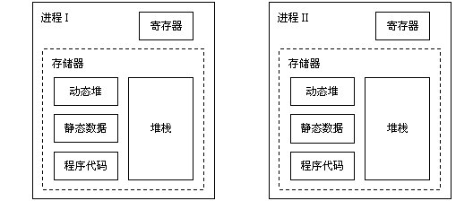

## swoole_process

进程是操作系统范畴的概念，进程是操作系统分配资源的基本单位。进程有自己的独立的堆栈、标识等信息。多个进程之间相互隔离地址空间。而线程是共享进程里的空间。所以有时候我们的程序在一个变量在多个进程的值是不一样。




进程之间的通信可以通过消息队列、管道、套接字来实现。

### 创建进程

```php
swoole_process::__construct(callable $function, $redirect_stdin_stdout = false, $pipe_type = 2);
```
`$redirect_stdin_stdout` 表示是否开启管道。如果设置false。我们在进程的输出会打印到屏幕上。

如果设置为true，会创建管道，子进程写的输出会重定向父进程的输入，我们在父进程read就可以实现父子通信。

`$pipe_type` 

- 0 不创建管道
- 1 创建`SOCK_STREAM`类型管道
- 2 创建`SOCK_DGRAM`类型管道

```php
$process = new swoole_process(function(swoole_process $worker){
    //子进程的逻辑
    $woker->name("php:woker");
},false,false);

$process->start();
```

### 回收子进程 wait

子进程结束必须要执行wait进行回收，否则子进程会变成僵尸进程。因为如果子进程退出后，会留下自己的资源，如果父进程不为它`收尸`的话，就会变成一个僵尸进程。 这个僵尸也会占用系统资源。

```php
swoole_process::signal(SIGCHLD, function($sig) {
  //必须为false，非阻塞模式
  while($ret =  swoole_process::wait(false)) {
      #子进程id
      echo "PID={$ret['pid']}\n";
  }
});
```

### 管道通信

管道一般都是单向，数据从一端流向另外一端。用个我们生活中的例子，比如下水道，就是一个管道，下水道，水就是数据，数据从上流到下面

```php
use \Swoole\Process;
function sonCallback(Process $worker){
    #子进程写入数据到父进程的管道
    $worker->write("我是子进程");
}

$process = new Process('sonCallback',true);
$process->start();

echo "读取子进程数据:".$process->read();//读取子进程数据:我是子进程
```

### 消息队列

消息队列就是先进先出，有两个操作，push、pop

```php
use \Swoole\Process;

function sonFun(Process $woker)
{
    $woker->push('我来自于子进程');
    # code...
}
$process = new Process("sonFun",false,false);//关闭管道

$process->useQueue();

$process->start();

echo "读取son进程数据:". $process->pop();
```

### 发起系统调用 exec

有的时候，我们需要让进程发生系统调用，也就是执行一些shell。或者之类的程序，就可以用exec

```
bool swoole_process->exec(string $execfile, array $args)
```

- $execfile 为可执行文件的绝对路径

- 传递给可执行文件的参数

  比如我们执行 `php -v`

```php
use \Swoole\Process;
$process = new Process(function(Process $worker){
    $worker->exec("/usr/bin/php",["-v"]);
    $worker->exit(0);
},false,false);
$process->start();
```

### 其他函数

- Swoole\Process ->daemon() 设置进程为守护进程
- Swoole\Process ->exit() 我们执行完子进程的代码后，要退出，然后让父进程为子进程清理资源

- Swoole\Process->setBlocking() 设置管道的阻塞模式
- Swoole\Process->name() 修改进程的名字


### 一个简单的例子


