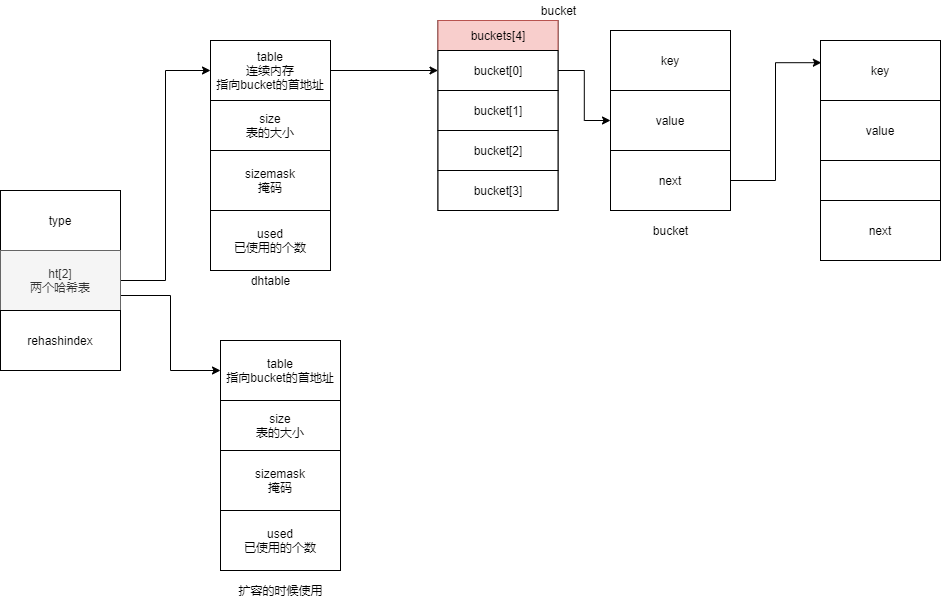

##Redis 哈希类型

> Redis hash是一个string类型的field和value的映射表。它的添加、删除操作都是O(1)(平均）。hash特别适用于存储对象。相较于对象的每个字段存在单个string类型。将一个对象存储在hash类型中会占用更小的内存，并且可以更方便的存取整个对象。

当以下条件中的任意一个被满足时， 程序会自动开始对哈希表执行扩展操作：

1. 服务器目前没有在执行 BGSAVE 命令或者 BGREWRITEAOF 命令， 并且哈希表的负载因子大于等于 1 ；
2. 服务器目前正在执行 BGSAVE 命令或者 BGREWRITEAOF 命令， 并且哈希表的负载因子大于等于 5 ；


当哈希对象可以同时满足以下两个条件时， 哈希对象使用 ziplist 编码：

1. 哈希对象保存的所有键值对的键和值的字符串长度都小于 64 字节；
2. 哈希对象保存的键值对数量小于 512 个；
>  hash-max-ziplist-value 选项和 hash-max-ziplist-entries 选项


- 字典被广泛用于实现 Redis 的各种功能， 其中包括数据库和哈希键。
- Redis 中的字典使用哈希表作为底层实现， 每个字典带有两个哈希表， 一个用于平时使用， 另一个仅在进行 rehash 时使用。
- 当字典被用作数据库的底层实现， 或者哈希键的底层实现时， Redis 使用 MurmurHash2 算法来计算键的哈希值。
- 哈希表使用链地址法来解决键冲突， 被分配到同一个索引上的多个键值对会连接成一个单向链表。
- 在对哈希表进行扩展或者收缩操作时， 程序需要将现有哈希表包含的所有键值对 rehash 到新哈希表里面， 并且这个 rehash 过程并不是一次性地完成的， 而是渐进式地完成的。


```c
typedef struct dictht {
    dictEntry **table;
    unsigned long size;
    unsigned long sizemask;
    unsigned long used;
} dictht;

typedef struct dict {
    dictType *type;
    void *privdata;
    dictht ht[2];
    long rehashidx; /* rehashing not in progress if rehashidx == -1 */
    unsigned long iterators; /* number of iterators currently running */
} dict;
```



myhash = {name:"zhangsan","age":12}

- hset 

添加一个hash值 。如果key不存在，创建key，存在，则覆盖原有值
语法：hset key field  value

	hset myhash  name "zhangsan"
	hset myhash  age "22"

- hget 

获取hash的值

	hget myhash name // zhangsan


- hlen

返回 key 指定的哈希集包含的字段的数量

	hlen myhash //2

- hexists 

判断hash值是否存在。存在返回1  否则返回0

	hexists  myhash name // 1

- HSETNX 

添加一个哈希值 存在啥都不做。

	HSETNX myhash name "test" //0 

- HSTRLEN

返回hash指定field的value的字符串长度，如果hash或者field不存在，返回0.

	HSTRLEN myhash name

- HVALS 

返回hash值里面所有的字段的值
	
	hvals myhash  // zhangsan 12

- HMSET 

批量设置hash值

	hmset myhash height "180" school "beijing"

- HMGET 

批量获取 hash的值下面的field的值

	hmget myhash height age // 180 12

- HKEYS 

返回所有的field。

	hkeys myhash // name age school height

- HGETALL

返回 key 指定的哈希集中所有的字段和值

- HDEL 

删除hash key 的filed

	hdel myhash name
