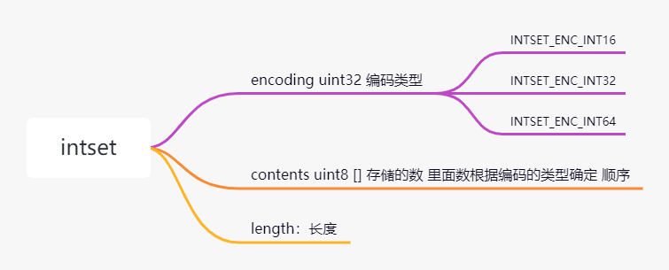

## Redis set集合

> Redis Set 是 String 的无序排列。SADD 指令把新的元素添加到 set 中。对 set 也可做一些其他的操作，比如测试一个给定的元素是否存在，对不同 set 取交集，并集或差

 集合可以有intset 、hashtable实现。
### intset 
当集合同时满足以下两个条件时，使用 intset 编码：
- 1、集合对象中所有元素都是整数
- 2、集合对象所有元素数量不超过512

整数集合（intset）是集合键的底层实现之一： 当一个集合只包含整数值元素， 并且这个集合的元素数量不多时， Redis 就会使用整数集合作为集合键的底层实现。



```c

typedef struct intset {
    uint32_t encoding; //表示编码 int16 int32 int64
    uint32_t length;//集合中的长度
    int8_t contents[];//存放的整数。
} intset;
```


- SADD 

添加一个或多个指定的member元素到集合的 key中.指定的一个或者多个元素member 如果已经在集合key中存在则忽略.如果集合key 不存在，则新建集合key,并添加member元素到集合key中.

 	SADD myset 1 
	
- SCARD 

返回(集合元素的数量).

myset  {1,2,3}

	SCARD myset // 3

- SDIFF 

返回两个集合之间的差集

myset1 = {1，3，4}
myset2 = {2，3，4}

	SDIFF myset1 myset2 // {1,2}

- SDIFFSTORE

语法 SDIFFSTORE k1 k2 new_key 

返回结果集的数

将两个集合的差集放到一个新的集合中。

	SDIFFSTORE myset myset2 myset2
	SMEMBERS myset // {1,2}

- SINTER

返回指定所有的集合的成员的交集.


	SINTER myset1 myset2  //{3，4}

- SINTERSTORE


返回指定所有的集合的成员的交集的数.并把交集放到新的集合中


- SISMEMBER

判断成员是不是集合中的元素，是返回1 否则返回0

	SISMEMBER myset1 2 //0
	SISMEMBER myset1 1 //1

- SMEMBERS

返回集合中的成员列表

	SMEMBERS myset1 {1，3，4}

- SMOVE

将一个集合中的元素移动到另外一个集合中

	SMOVE myset1 myset2 '1'

- SRANDMEMBER

随机返回key集合中的一个或者多个元素.

	SRANDMEMBER myset1 2  //{1,4}
	SRANDMEMBER myset1 // {1}

- SREM

在key集合中移除指定的元素

	SREM myset "1"

- SUNION

返回多个集合中的共同的所有成员

 	SUNION myset1 myset2 // {1 ,2,3,4}

- SUNIONSTORE 

返回多个集合中的共同的所有成员的数，并存在一个新的集合中

	SUNIONSTORE newset  myset1 myset2
	smembers newset

- SPOP

删除并返回一个或者多个随机的集合元素

### 集合使用场景

集合中的元素的是不重复的 可以取并集，差集，获取随机元素，比如做web版的扑克牌游戏。将54张扑克放入一个集合中。用spop随机发牌。
