## XDEBUG+PHPSTORM 开发 调试

在我们开发过程中。我们如果经常性的echo、dump效率很低。所以我们就可以使用xdebug进行断点调试。

下面的教程以 **Windows**  操作系统为例子。其他操作系统类似。

### 1. 下载xdebug

安装xdebug前，请确定自己的php版本和使用的TS或NTS。如果实在不清楚，可以通过以下方式查看


如上图，第一个红框就是现在使用的php的版本，

第二个框就是你使用php编译的X86还是X64.

第三个是表示加载的php.ini的位置。我们会用到，后面需要改php.ini。就是改这个位置。一定不能改错了。

第四个框，就是Thread Safety 如果是 diabled 就表示我们用的PHP是**NTS**的。如果是enable 就代表是**TS**的。待会选择xdebug的时候就会用到上面的信息。

下载地址：https://xdebug.org/download.php

根据我们上图的信息，我们选择的应该是php7.1 x86 nts的 xdebug拓展

32bit 就是32位操作系统。也就是x86. **如果后面没有写TS ，就代表这个拓展是NTS的**。不要选错了。

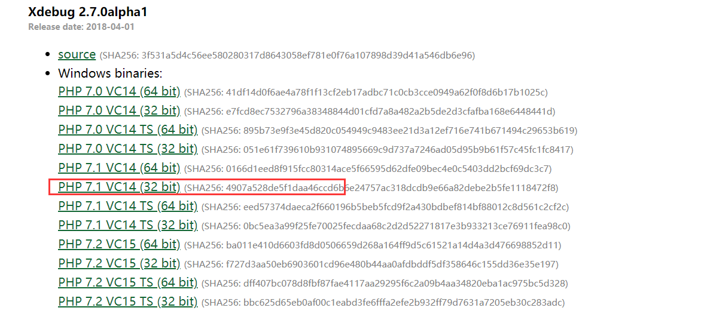


### 2. 安装Xdebug

将我们上面下载好的拓展移动到 **php 的 extension_dir 的目录**。如果不知道自己的拓展目录在哪。还是可以通过`phpinfo`查看

搜索 **extension_dir**  就是拓展所在的目录。

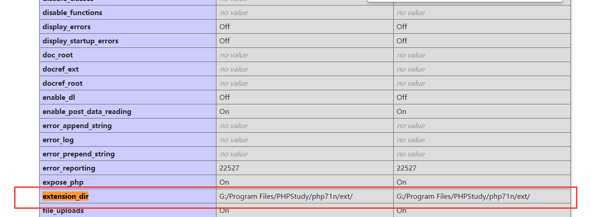

### 3. 配置Xdebug

打开 **php.ini**  php.ini 的位置。通过**phpinfo()**中进行查看。 以免改错位置。

在后面加上一下配置

```ini
[Xdebug]
;拓展的位置。这里一定要zend_extesion
zend_extension="php_xdebug-2.7.0alpha1-7.1-vc14-nts.dll"
;启用性能检测分析
xdebug.profiler_enable=on
;启用代码自动跟踪
xdebug.auto_trace=on
;允许收集传递给函数的参数变量
xdebug.collect_params=on
;允许收集函数调用的返回值
xdebug.collect_return=on
xdebug.remote_enable=1
xdebug.remote_handle="dbgp"
xdebug.remote_mode="req"
xdebug.remote_host="localhost"
;端口 可以自己更改，不要冲突，待会需要用到
xdebug.remote_port=9002
xdebug.idekey="PHPSTORM"
xdebug.collect_includes = 1
xdebug.remote_autostart = 1
;指定堆栈跟踪文件的存放目录
xdebug.trace_output_dir="D:/debug"
;指定性能分析文件的存放目录
xdebug.profiler_output_dir="D:/debug"
xdebug.profiler_output_name = cachegrind.out.%t.%p
```

### 4. 验证Xdebug

验证Xdebug。同样使用我们的 `phpinfo` 进行验证。记得改完配置，记得重启apache或者nginx 或者其他的web服务器

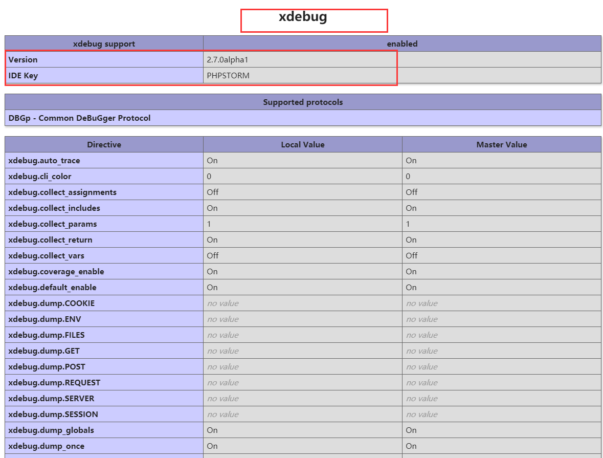

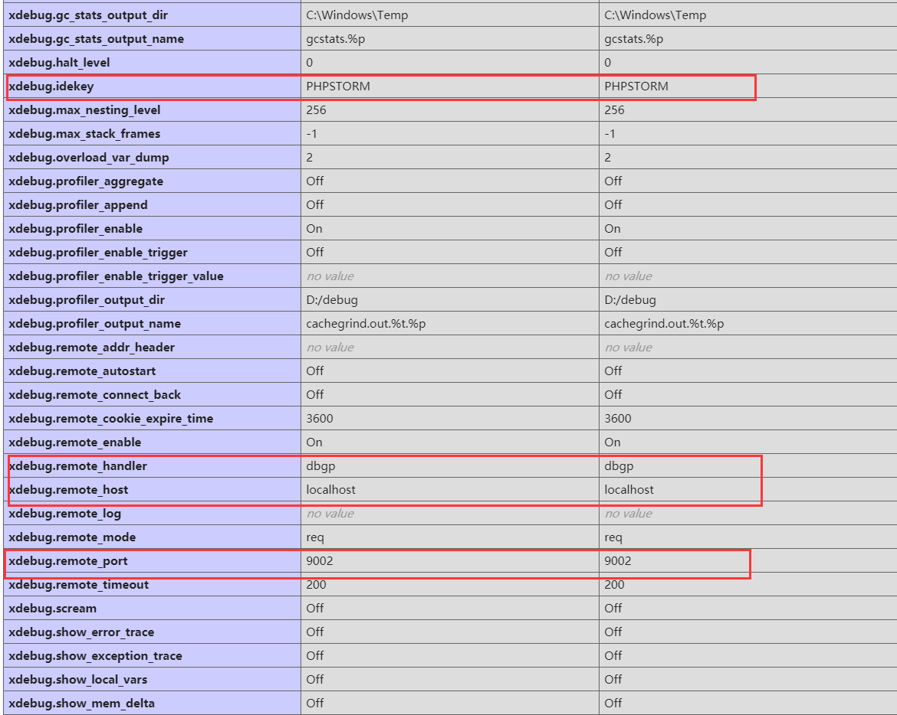

搜索xdebug。 看到上面的界面就是配置成功了。然后再检查上面的配置是不是和你设置的一致。


## PHPSTORM 整合Xdebug 进行断点调试

### 1. 配置Cli Interpreter

**settings** -->**Languages Frameworks** ---> **PHP**

点击红框内的 **...**

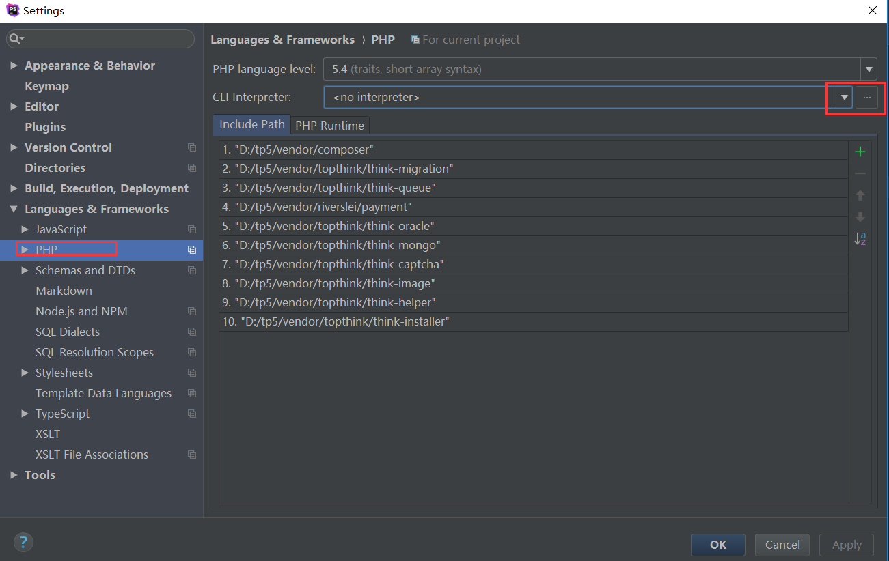

- 先点击下图的 **+** 添加一个新的cli 。

- 点击 **...** 选择你的php.exe的位置。 这个php 一定是你的web用的。跟我们配置Xdebug的要一样。 

  选择了之后，底下就会检测到我们的php的版本，和xdebug版本以及php.ini的配置。如果这里的信息和我们phpinfo 看到的不一样，就要检查下，是不是选择的php的版本不对。

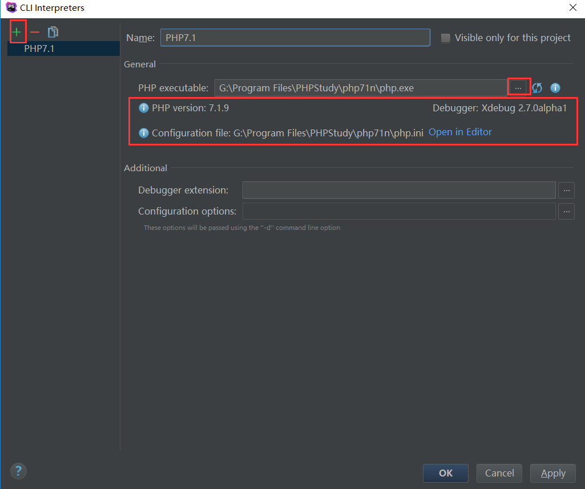


### 2. 配置debug

**settings** -->**Languages Frameworks** ---> **PHP** --->**Debug**

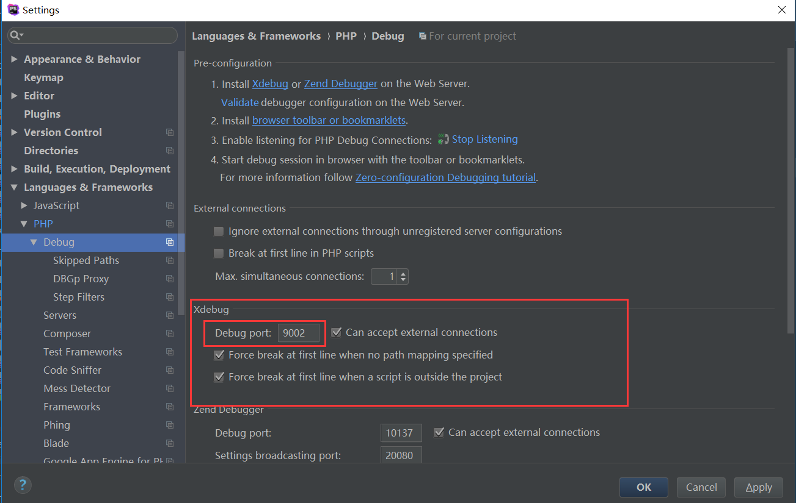

更改红框中的端口为我们在php.ini中的配置的端口。我们在php.ini配置了9002.所以这里也要写上9002.不要写错了。否则就会有问题。

- 然后再点击我们**DBGp Proxy**

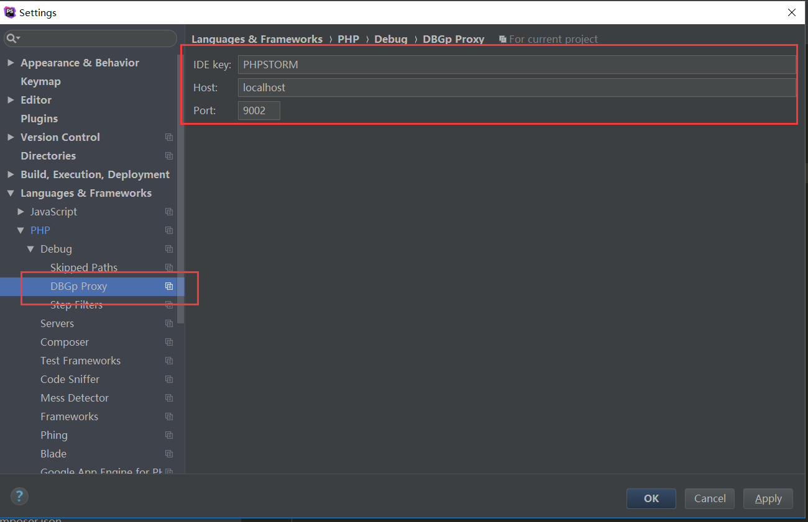

红框中的配置。按照我们在php.ini中的配置进行填写。

```ini
xdebug.idekey="PHPSTORM"
xdebug.remote_host="localhost"
xdebug.remote_port=9002
```

### 3. 配置Server

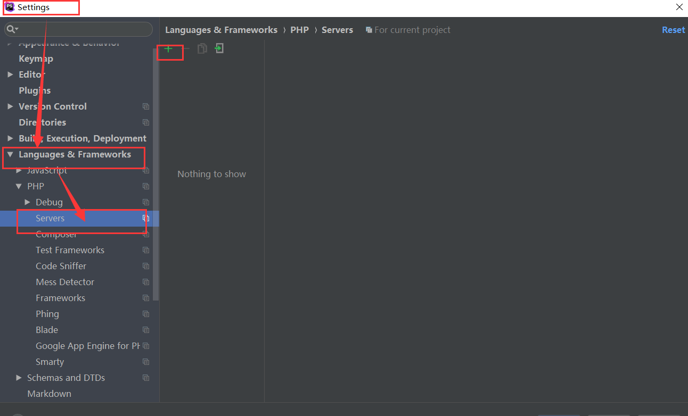

然后自己本地需要debug的**host** 、 **端口**

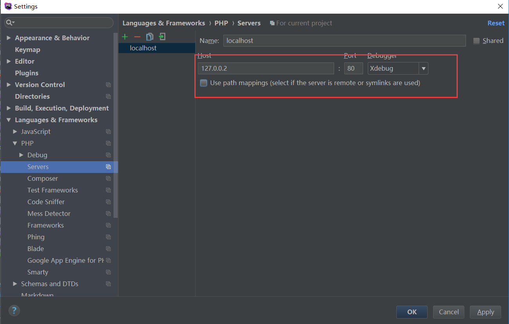


### 4. edit cofigure

点击菜单栏中的**run**。 然后点击edit Congiurations

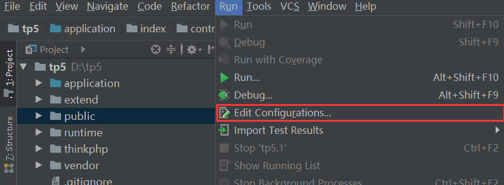

在出来后的选项中，点击 **+** 然后选择 **PHP Web Page**

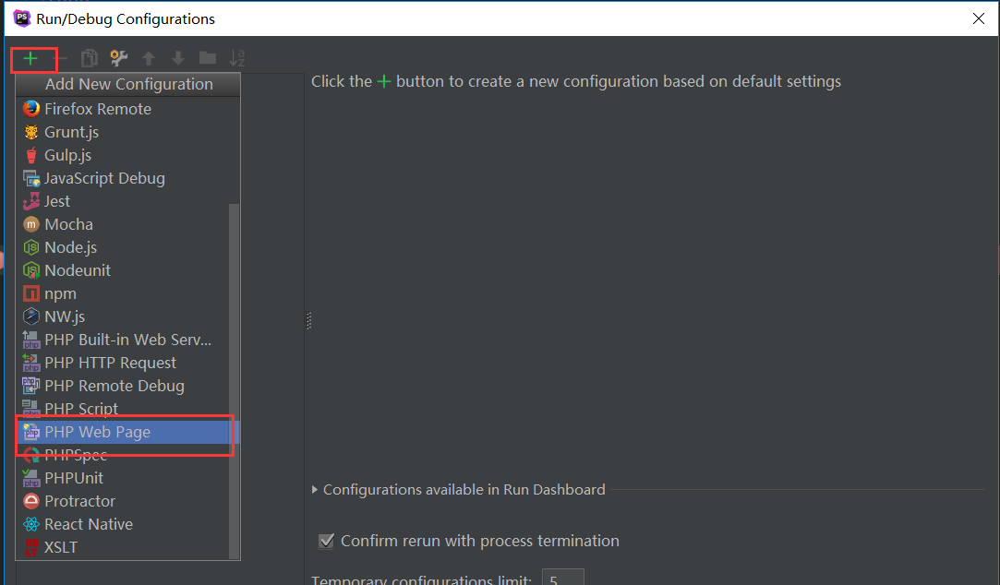

选择你刚才 添加的 **server** 以及起始的web地址。 点击 **apply** 应用

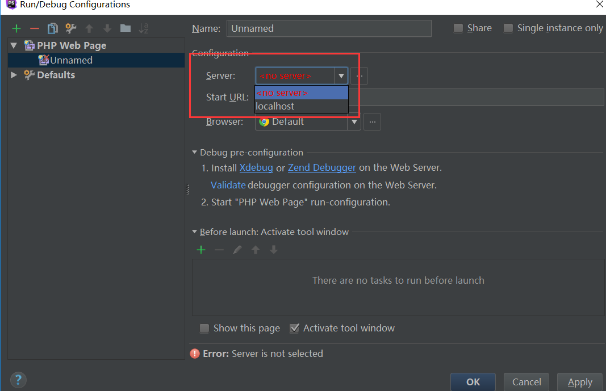


### 6.开启监听

点击下图中的这个**小电话**的图标。 让你变绿色。

**没有监听的状态**

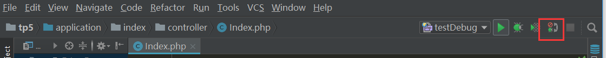

**正在监听的状态**

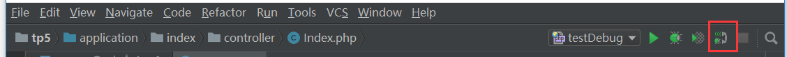


### 7. 开启调试

在我们需要调试的代码处，我们需要加上一个断点，然后程序运行到这个地方，就会停下来。下面以TP5为例子。

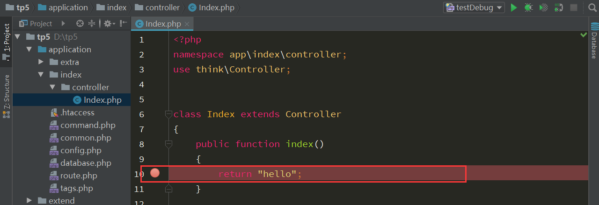

然后我们运行我们的项目。就会发现浏览器卡住了，这个时候，我们打开PHPstorm。就会发现。程序停下来了。

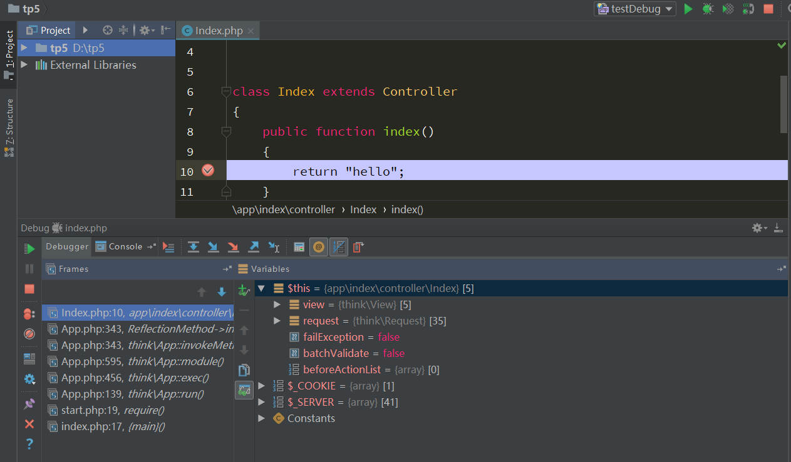

我们可以很清晰的看到上下文的变量的值。以及框架的执行的流程。这对我们分析一个框架，是很有帮助的。

然后我们可以进行**单步调试，或者步入、跳出**等操作

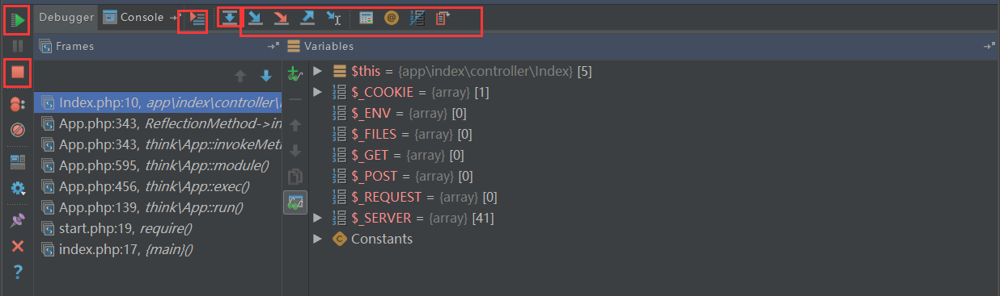

图中，所有画红圈的就是常用到的工具。其具体功能介绍如下：

- 重新请求


> 此工具，点击后，当前调试所有变量全部销毁，重新开启一轮请求。即如同刷新页面。

- 执行到下一个断点，暂停


> 此工具点击后，继续 Laravel 生命进程的路程，直到下一个断点，暂停

- 停止调试


> 此工具，停止调试，结束 Laravel 周期。

- 变量栏


> 变量栏标签，下面的内容是当前调试位置所有能够用到的变量（包含全局和局部），记住能用到就会显示

- 定位到当前调试的文件以及行


> 此工具的作用是当调试行文件关闭了，或者代码视图跑到其它位置了，点击它，就能重新定位到调试文件以及调试行

- 跳过当前调试行代码要执行函数，直接返回结果


> 此工具的作用是当调试行代码有调用函数，包含文件，new 新对象时，能够不进入相应函数、文件、类中，直接返回其调用的结果，在当前行中，执行下文

- 进入和强制进入调用的函数内


> 此工具功能正好和上面的相反，即进入和强制进入当前调试行将要调用的函数、方法、包含的文件、new的新对象类文件中，执行相应代码

- 跳出正在调用的函数


> 跳出正在执行的函数、方法、包含的文件、new 新对象的类文件，至调用行，并继续执行调用行下面的代码